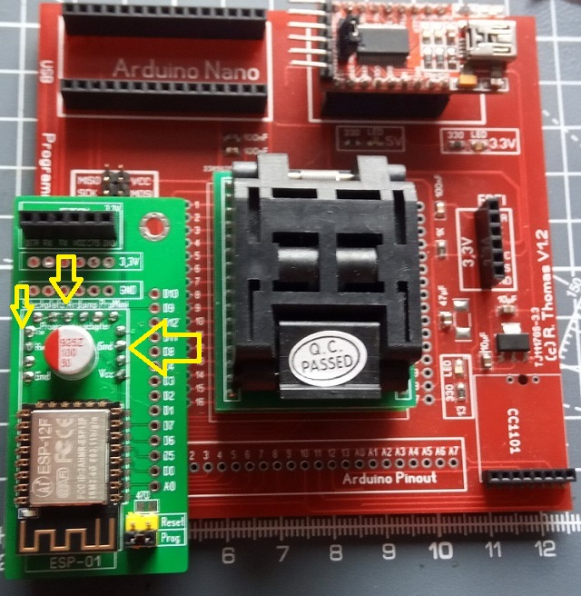

# ESP-12 Ürogrammieradapter
## benötigte Hardware 

* 1x ESP-12 
* 1x Kondensator 100µF (min 6V) RM3,5
* 1x Widerstand 470Ohm für Reset
* 24x Pfosten Pins PM2.0 (2x8Pins, 1x6Pins)
* 1x Pfosten Pins 2x2 RM2,54
* 1x Jumper RM2,54
* 1x Buchsenleiste 6Pin RM2,54 zum Anschluss des FDTI

Wahlweise kann der Adapter auch auf die "größe" [Programmierplatine](https://github.com/ronnythomas/Programmieradapter) gesteckt werden. 

[Kontakt via Facebook](https://www.facebook.com/ronny.thomas.83)

[Kontakt via Homematic Forum](https://homematic-forum.de/forum/memberlist.php?mode=viewprofile&u=13127)

